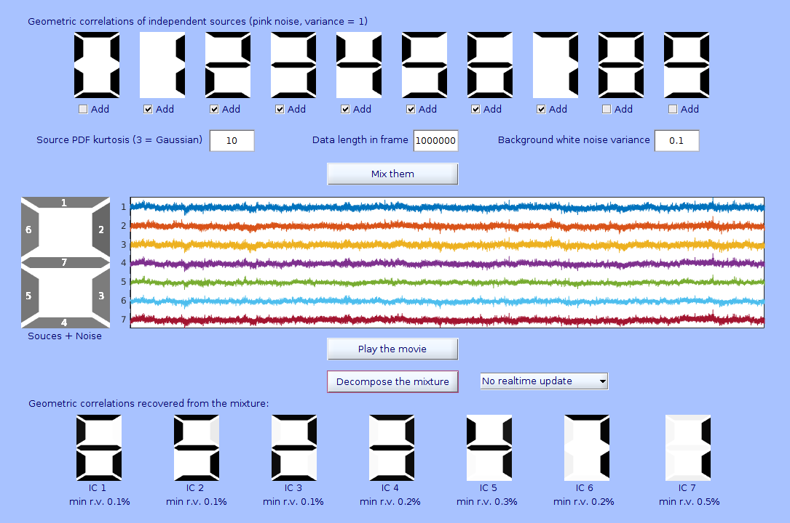
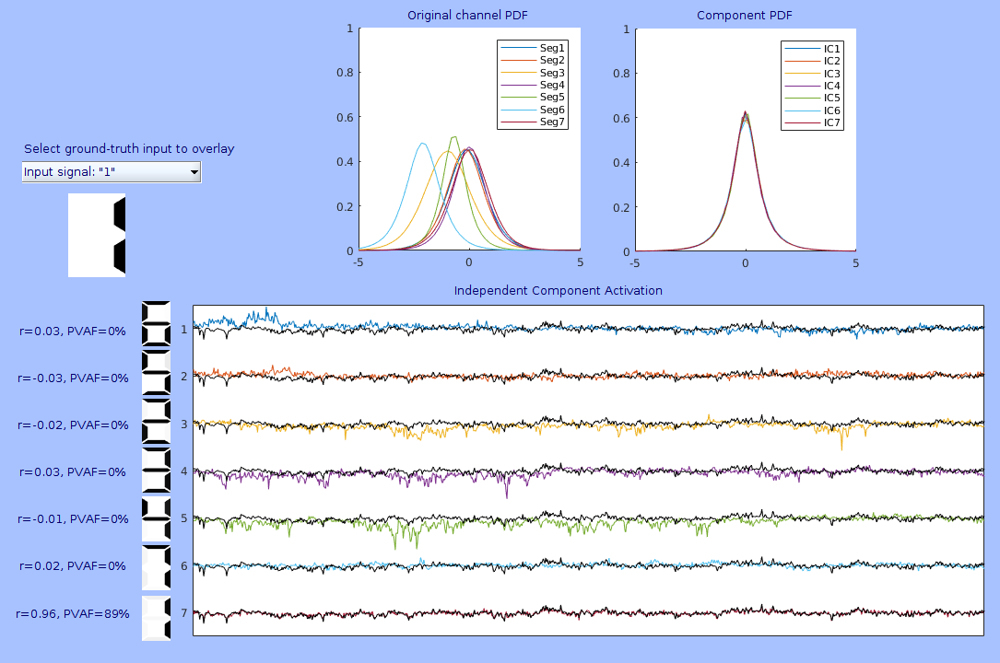

Download ver.0.20 (11/08/2020 updated)
======================================

[Download
sevenSegmentica0.20](/Media:sevenSegmentica0.20.zip‎ "wikilink")

Demo movie on Youtube (10/08/2020 added)
========================================

[Infomax ICA demo with Seven Segmentica (EEGLAB
plugin)](https://youtu.be/CGOw04Ukqws) on Youtube.

What is *sevenSegmentica()* for?
================================

This is a tool to give a classical ICA demo for decomposing overlapped
seven-segment number displays (0-9) with independent (and kurtotic) time
series data with some white noise. Many of EEGLAB users have been using
ICA in data preprocessing. But are you comfortable with explaining this
demo for detail? I hope this demo provide a good proof of concept for
beginners, an educational opportunity for learners, a quick validation
of predictions for experts, and pure fun for everyone!

How does it build simulated data?
=================================

1.  A user specify ground-truth inputs. The default selections are "2"
    "4" "6", so let's use this selection as an example here.
2.  In the seven segment mapping, for example the first input "2" is
    represented by channel 1, 2, 7, 5, and 4, or \[1 1 0 1 1 0 1\]' in
    Matlab.
3.  Normalized pink noise (variance = 1) with user-specified kurtosis,
    say 8, and data length, say 10000, is generated and assigned to "2".
    This defines the ground-truth data matrix G2, which is \[1 1 0 1 1 0
    1\]'\*\[pinknoise_length10000\] in Matlab, creating 7x10000
    variable. Note the critical fact in the current case ("2"), at this
    stage time series data for channel 1, 2, 7, 5, and 4 are perfectly
    correlated (identical), and the rest of the channels have just
    zeros.
4.  The pink noise is generated independently for each ground truth in
    the same way. Thus, G4 and G6 are generated for "4" and "6",
    respectively.
5.  In addition to the ground truth inputs G2, G4, G6, a white noise E
    with user-specified variance, say 0.3, are added to create the
    "mixed signal" M such that M = G2+G4+G6+E.

Correspondence to EEG recording
===============================

Note the correspondence to EEG recoreding--in this case, M corresponds
to scalp recording (i.e., after mixing via volume conduction), and G2,
G4, G6 correspond to latent independent 'effective sources' (i.e.,
before mixing). The location of each stroke in seven segment display
corresponds to electrodes. But note also the critical difference--in
standard EEG recording, you don't know ground truth. Therefore, even if
you obtain ICA results, it is not immediately clear (and ultimately not
clear either) if the decomposition is good or bad. However, in this demo
because we have ground truth defined on the same seven segment number
display, we can evaluate how good the decomposition quality is
immediately and intuitively--if you can read the number, it means
successful!

How do we evaluate goodness of decomposition?
=============================================

Residual variance (r.v.)
------------------------

After ICA is performed, "min r.v." at the bottom of the first GUI page
is provided. This is calculated by sum((D1-D2).^2)/sum(D2.^2) where D1
is 7x1 ground truth vector; for example, in the case of "2" it is \[1 1
0 1 1 0 1\]'. D2 is also 7x1 size but this is from obtained
decomposition. *'Minimum* r.v.' means that because ICA does not find
correspondence between input ground truth and the output, the r.v. shown
here is the smallest value across 10 comparisons against all the ground
truths. Smaller the r.v., more similar the seven-segment representations
are.

Correlation coefficient (r)
---------------------------

This measure is available only when you know ground truth. The
correlation is calculated between the time series of the ground truth
you used as input and IC activations.

Percent variance accounted for (PVAF)
-------------------------------------

This is also a measure available only when you know ground truth. PVAF
is calculated as 100\*100-var(Y1-Y2)/var(Y2) where Y1 is time series of
ground truth and Y2 time series of IC activation. Note that this
definition/calculation of PVAF is different from that is supported in
*envtopo()*, in which PVAF = 100\*100-mean(var(Z1-Z2))/mean(var(Z2))
where Z1 (scalp back-projection of selected ICs) and Z2 (scalp
back-projection of all ICs) are both channel x time, and variance is
calculated across channels, then averaged across time.

Why does ICA work?
==================

In this demo, note how ICA maximizes non-Gaussianity in the probability
density function (PDF) plots in the top row of the second-page GUI. This
PDF is calculated after normalizing the signal to Z-score. Because of
central limit theorem (CLT), PDF of each channel of M becomes
necessarily more Gaussian than each of 'effective sources' G.

*`Central`` ``Limit`` ``Theorem`` ``(CLT)`*
`Mixing signals   -> Approaching to Gaussianity (kurtosis == 3)`
`Unmixing signals -> Departure from Gaussianity (sub/super-Gaussian)`

Therefore, as long as the mixing process exists, there is always
possibility for ICA to work in. In fact, the mixing process is
guaranteed in scalp-recorded EEG by volume conduction, which is a
problem of how an electric field is formed between cortical surface and
electrode surface.

How do I obtain better decomposition performance?
=================================================

Generally, ICA works better if 1) data are more non-Gaussian (bit in
this demo, only super-Gaussianity, which is kurtosis\>=3 is supported);
2) data are longer; 3) there is less noise.

Suggested experiments and quiz
==============================

Based on the above argument, it is clear that in order to achieve seven
number decomposition, you need to set 1) very high kurtosis, 2) very
long data, and/or 3) very little noise. Because this is simulation, you
can set any arbitrary numbers here if you don't mind spending longer
data for ICA. However, what is the minimum condition to decompose seven
numbers? Consider Think about the following points.

-   Try to find a set of limit parameters that barely performs
    successful decomposition--for example, for a given number of ground
    truth inputs, kurtosis 6 but not 5, data length 15000 but not 10000,
    or white noise variance 0.25 but not 0.30.
-   Press "Mix them" and "Decompose the mixture"--does it change the
    result? How badly stochastic the results is?
-   Change the choice of ground truth, without changing the total number
    of them. Does it affect the results? Does the number of strokes in
    the numbers matter? Is it easier to decompose "1" than "8"? Why?
-   Change the number of ground truth inputs. How does it affect the
    result? Why?
-   Note the order of the output numbers--is it always fixed? EEGLAB's
    runica() outputs results according to signal variance. Does it
    explain the output order?
-   Look at the PDF plots. Why the original channel PDF plots show their
    peaks being non-zero, though they are Z-scored? Why are the peaks in
    the component PDF are aligned to be zero?
-   How do ICA evaluations in spatial domain (r.v.) and time domain (r
    and PVAF) relate to each other? Is it possible that you get good
    result only one of the two?
-   Set a very easy decomposition conditions with less inputs, long
    data, and less noise, but kurtosis == 3. What happens? If you don't
    know the answer, go back to [this
    section](https://sccn.ucsd.edu/wiki/SevenSegmenticaDemo#Why_does_ICA_work.3F).
-   In EEGLAB equivalent dipole fitting using Fieldtrip, we see 'r.v.'.
    What is the ground truth used there?

Screenshots
===========

Author: Makoto Miyakoshi, SCCN, INC, UCSD.